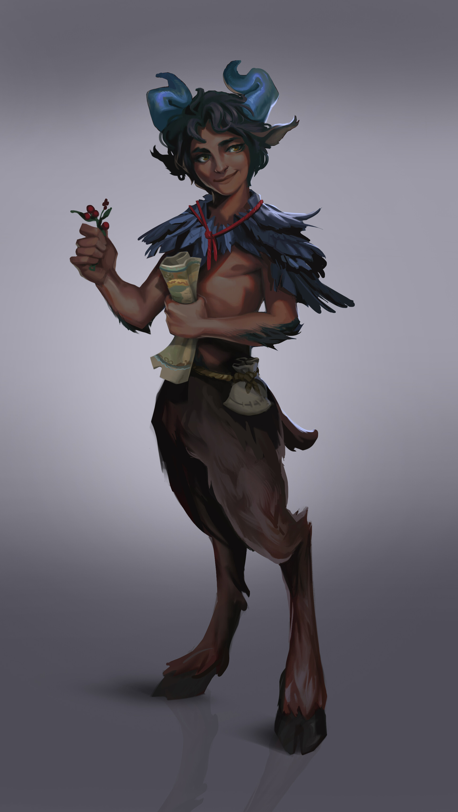

+++
title = "Elderberry Gris"
description = "they/them"
+++

Elderberry Gris is a satyr who has lived many lives. They started out in the
feywild on Broken Fang Isle during the rule of the pirates over Edermayer.
Elderberry had always been intrigued by the pirates, but fell in love first with
the arcane, and studied for many years under the tutelage of the fey wizards.

Elderberry studied magic with the mages for many years, but eventually felt as
though there was something missing from their studies. Elderberry always wanted
to go out and experience the world, and put their newfound powers to the test.
Never forgetting the excitement of the pirates who lived so nearby, eventually
they were drawn in by the allure of the sea, and traveled to Emitton to find a
crew to sail with.

Quickly falling in with a crew, Elderberry went out on their first voyage to far
off lands to find wonders unseen. Though the danger of the sea was always
present, Elderberry thrived in the perilous environment, always keeping their
cool, and learning more about the capabilities of their spellcasting. Every time
the crew returned to harbor, Elderberry had learned more arcana, and climbed the
ranks of the pirates little by little, earning their respect not just as a
powerful wizard, but as a respected if unconventional leader.

After man years of sailing, a rumor made its way to the captain of the boat
Elderberry sailed on. A rumor of powerful magic, and a lost boat that could
nearly sail itself with the right captain. The crew was naturally intrigued, and
set sail far to the North, into perilous and uncharted waters beyond the trading
kingdoms of the Mantay Sea.

The months the voyage was meant to take stretched into a year, and then two, and
still the islanders on Edermayer had not heard of the fate of Elderberry.
After those two years, Elderberry returned, but without a single of the original
crew remaining. They sailed into harbor captaining a ship of 10, and bearing
news only of cursed waters and lands meant not to be touched by sane mortals.
Elderberry would not say more, and retreated back onto Broken Fang Isle, back to
the wizards they had studied under many years ago.

By this point, Elderberry had worked up quite a reputation for themselves, and
such a mysterious return evoked interest among fey and pirate alike. Elderberry
still maintained their usual upbeat demeanor, yet despite the nagging questions,
refused to elaborate on what they had discovered on the voyage. Eventually, they
set sail again, on a small boat crewed by 30, to set sail for uncharted waters
once more.

Elderberry disappeared for many years, and during their absence, the Setallians
arrived on the island, taking control of it as one of their colonies. The pirate
resistance formed, fighting back against the colonizers while they could, but
steadily losing ground. Then, suddenly, Elderberry returned. They sailed into
Emitton, and promptly joined the pirate resistance amid whispers of what had
transpired on their voyage.  Many in the resistance have heard talk that
Elderberry returned with some artifact from those unknown lands, which now
serves to protect the remaining pirate port in Emitton. What this artifact is,
or what exactly it does is unknown, but all attempts by the Setallians to take
the port have been summarily repelled by the resistance.

Elderberry quickly became one of the leaders of the pirate resistance, and
worked tirelessly to keep the organization running and safe. After the assaults
on Emitton died down, Elderberry made their way to New Cametton. There, they
convened with what of resistance remained, but a traitor in their midst caused
havoc, and Elderberry was captured. It was only thanks to the quick rescue
actions of the Star Lightlace, Markus Reed, Galvorn Farseer, and Madea
Praxidike, that Elderberry is free once more.

Now, Elderberry knows that time grows short, as pressure from the Setallians and
cult grows to a breaking point. They will help the heroes on their quest to
retrieve the last artifact of the island, whatever is required.
