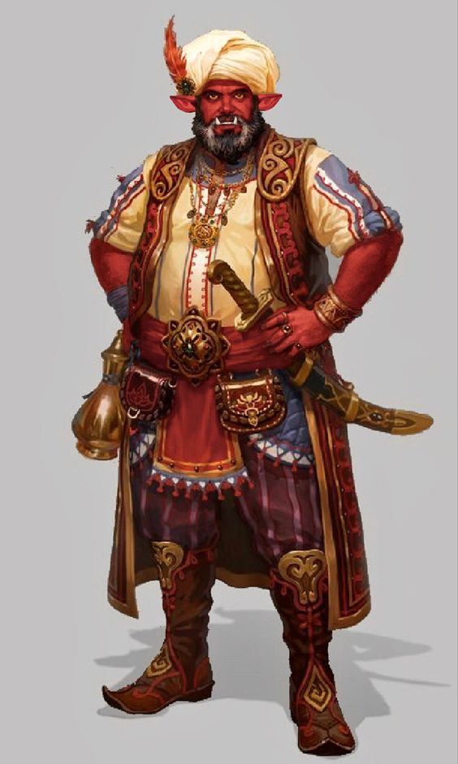

+++
title = "Grant of Ericson"
description = "proprietor of all things notable"
+++

A wealthy connoisseur of magical and historical artifacts, Grant of Ericson is
a large hobgoblin who runs a bit of an underground speakeasy, gambling ring, and
item shop. I call it an "item shop", because it's not clear that any category
more exactly describes the sorts of things Grant is interested in. He deals in
antiques, magical artifacts, and anything else he finds notable.

Grant runs his shop beneath a blacksmith in [New
Cametton](@/wiki/new_cametton.md), and his customers have been loyal enough to
not rat him out yet. Perhaps its because they fear he may
have more ability in his horde than they want to deal with. At any rate, those
who stumble upon him in the right circumstances, or else those bearing his
business card are free to enter the establishment and barter or buy whatever
they might find, provided of course they can pay the fee.

Aside from the usual things one might trade for, Grant is also always interested
in a more unconventional trade offer: taking a bit of fate. It's unclear to most
of his patrons what exactly this means, but the automata fortune teller he
directs them to in order to make the trade gives off a strangely legitimate
aura, enough to dissuade many potential customers.
