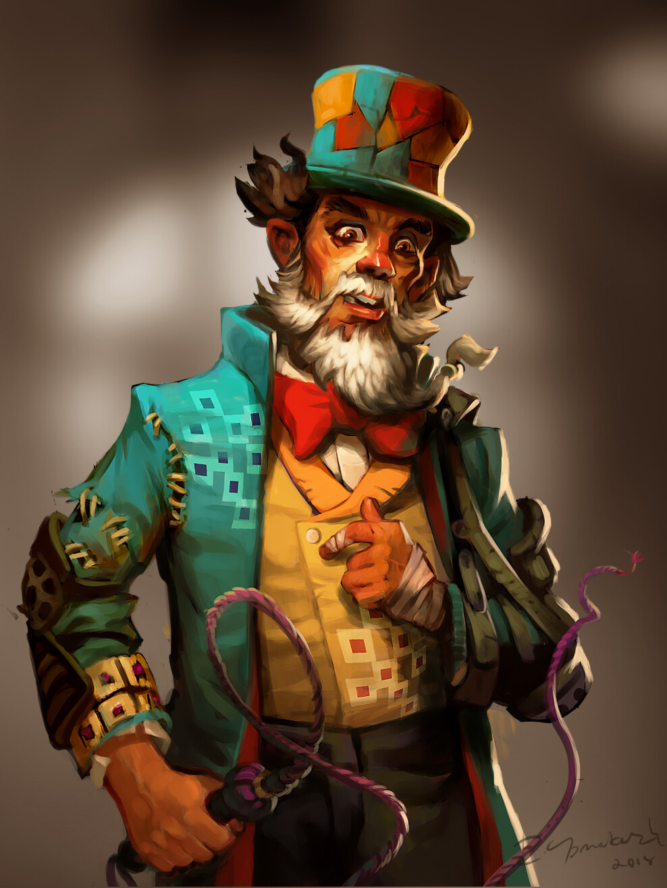

+++
title = "Stephano Dark"
+++

Stephano Dark is the enigmatic ringmaster of the Circus of the Great Mare. He
seems to be one of the few people who always knows what's going on behind the
scenes, and has ties to nearly every faction vying for the island save the
Setallians. He has traveled with the adventurers on several of their escapades,
quietly observing, and providing combat support when he can.

Stephano was born into the Circus, and grew up learning all he could about the
ways of the natives of the island. He, more than perhaps anyone else,
understands the many aspects of the ancient magic which is at work here, though
there are mysteries beyond even his knowledge.

Well into adulthood, Stephano disappeared for many years, chasing after
knowledge elsewhere in Kalibar. He set sail across the sea, searching for
something unknown to all but those closest to him.  Shortly before the
Setallians invaded Edermayer, Stephano returned to the port of New Cametton,
bringing something secret with him.

Now, Stephano helps lead the resistance against the Setallians. Some question if
he really wants to see the pirates back in power, and rumors abound about
ulterior motives and what he left for in the first place. Most who have been on
this island before occupation though, have come to accept that his interests
align with theirs, and see him as a force for the good of Edermayer.

