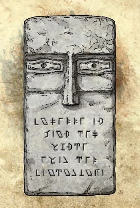

+++
title = "Face of Gorm"
description = "a.k.a. the Delimbyr Bloke"
+++

Insribed on the beard are words in dwarvish reading:

"Friendship is more than a word. Weight it carefully."

As an action, you can speak the command phrase "aid us" to cast the daylight spell, or summon 1d4 [Guards of Gorm](../../monsters/guard-of-gorm) to fight for you. This ability recharges daily at sunrise.

When summoning guards, you choose one of the following modifiers to apply to all the constructs:

<ul>

<li>

**Buff**: The Guard of Gorm gains an extra 5 hit points.
</li>

<li>

**Celerity**: The Guard of Gorm’s land speed is increased by 10 feet.
</li>

<li>

**Deflection**: The Guard of Gorm gains a +1 bonus to Armor Class.
</li>

<li>

**Fly**: The Guard of Gorm has physical wings and a fly speed of 20 feet.
</li>

<li>

**Bull** Rush: If the Guard of Gorm has at least 10 ft to get a running start, it can charge an opponent to push them back. Make a contested check like taking the shove action. If the Guard of Gorm succeeds, they and their target are pushed back 5 feet. You can push an additional 5 feet for every 5 points of difference in the rolls.
</li>

<li>

**Brawler**: The Guard of Gorm has no weapon, but deals 1d4 damage with an unarmed strike.
</li>

<li>

**Mobility**: The Guard of Gorm can use disengage as its bonus action.
</li>

<li>

**Power** Attack: The Guard of Gorm can choose to take a -5 to hit for a +5 to damage.
</li>

<li>

**Resistance**: The Guard of Gorm gains resistance to a damage type of your choice.
</li>

<li>

**Swim**: The Guard of Gorm is streamlined and shark-like, and gains a swim speed of 30 feet.
</li>

<li>

**Takedown**: The Guard of Gorm has advantage on any non-attack combat actions (e.g. shove, grapple).
</li>

</ul>
