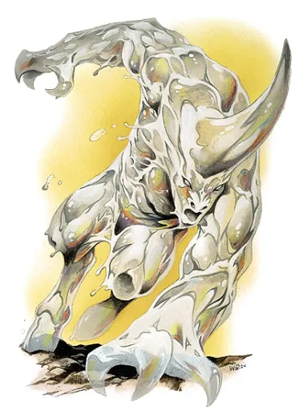

+++
title = "Guard of Gorm"
+++

## Guard of Gorm

medium, construct

**Armor Class** 16

**Hit Points** 31

**Speed** 30

<table>
<thead>
<tr>
<th> STR </th>
<th> DEX </th>
<th> CON </th>
<th> INT </th>
<th> WIS </th>
<th> CHA </th>
</tr>
</thead>

<tbody>
<tr>
<td> 17 (+3) </td>
<td> 15 (+2) </td>
<td> 10 (+0) </td>
<td> 10 (+0) </td>
<td> 11 (+0) </td>
<td> 10 (+0) </td>
</tr>
</tbody>
</table>

**Saving Throws** STR, DEX (+2)

**Skills** Acrobatics, Athletics, Sleight of Hand, Stealth (+2)

**Condition Immunities** charmed, exhaustion, frightened, paralyzed, petrified, poisoned

**Senses** darkvision 60 ft

### Actions

**Battleaxe**

*Melee weapon attack*: +5, reach 5 ft

*Hit*: 1d10+3 slashing damage

 

**Unarmed Strike (Brawler only)**

*Melee attack*: +5

*Hit*: 1d4+3 bludgeoning damage

A monster of flowing magical energy that looks almost metalic in nature, these guards were sworn to serve their king and his allies whenever called. After venturing into Firehammer Keep, our adventurers came across a puzzle room with a large dwarven statue. Here, the Guards of Gorm were first summoned as a test of might that those who ventured into Gorm Firehammer's tomb could prove themselves worthy of his aid.

Those who prove worthy are granted the [Face of Gorm](/items/face-of-gorm), an artifact which allows the wielder to summon these guards to their aid at will. The guards don't seem to communicate at all, but always seem drawn towards ruins and markings of the ancient dwarves.
